# Algebras: a study and comparison of geometric-algebra implementations

This repository collects small, self-contained Python implementations of
several geometric algebras and the visualization tools used to compare
their elements and transformations side by side. Each subpackage is kept
independent so that the underlying representations (multivector layout,
basis ordering, sign conventions) can be studied in isolation and then
contrasted against the others.

The collection currently contains two implementations:

| Section | Module | Algebra | Underlying representation |
| --- | --- | --- | --- |
| [PGA3D](#pga3d) | [pga3d/](pga3d) | 3-D Projective Geometric Algebra `R(3, 0, 1)` | 16-component multivector |
| [SimpleGA](#simplega) | [simplega/](simplega) | `GA(2,0)`, `GA(3,0)`, `GA(3,1)`, quaternions | grade-split (Even / Odd) blocks |

All figures in this README are generated from code in [doc/](doc); see
the "Regenerating the figures" subsection of each section to reproduce
them.

---

## PGA3D

`pga3d` is a Python library for doing geometry in 3-D using 3-D
Projective Geometric Algebra (`R(3, 0, 1)`). It exposes high-level
objects (`Point`, `Line`, `Plane`, `Translator`, `Rotor`) so that
intersections, joins, and rigid-body transformations are one-liners,
while hiding the algebra from callers who do not want to learn it.

**Benefits over linear-algebra-based libraries**

* Small core: once the algebra is set up, conversions, intersections,
  and joins are one-liners.
* Translations and rotations compose with minimal loss of precision
  (compared with multiplying 4×4 matrices).
* Transformations are linear in the algebra, so multiplying them yields
  smooth interpolation.
* Edge cases are first-class: intersecting two parallel lines yields a
  point at infinity (a direction) rather than an exception.
* No implicit choice of right-handed vs left-handed conventions.

### Citation / upstream

This package is derived from Almar Klein's `pga3d` project, which served
as the starting point for the implementation and API. See:

* Almar Klein, *pga3d* — https://github.com/almarklein/pga3d

Background reading on (projective) geometric algebra:

* Introductory talk: https://www.youtube.com/watch?v=tX4H_ctggYo
* General resources: https://bivector.net
* 3D PGA cheat sheet: https://bivector.net/3DPGA.pdf
* PGA explained for devs: https://observablehq.com/@enkimute/understanding-pga-1
* Geometric algebra in JS (interactive): https://github.com/enkimute/ganja.js
* C++ implementation of 3D PGA (Klein): https://github.com/jeremyong/Klein

### Usage

All geometric objects and transformations live in the top-level
[`pga3d`](pga3d/__init__.py) package. Points, lines, and planes are
built from incidence (e.g. a line is the *join* of two points), and
`Translator` / `Rotor` act on any object via `.project(...)`.

```python
import math
from pga3d import Point, Line, Plane, Translator, Rotor

# Build geometric objects from points
p1 = Point(2, 3, 4)
p2 = Point(20, 3, 7)
p3 = Point(9, 12, 17)

line = Line.from_points(p1, p2)            # join of two points
plane = Plane.from_points(p1, p2, p3)      # join of three points

# Compose a rigid-body motion: rotate 90° around z, then translate by +3x
t = Translator.from_xyz(3, 0, 0)
r = Rotor.from_angle_and_line(math.pi / 2, Line.from_xyz(0, 0, 1))
m = t * r                                  # composition is just multiplication

p1_moved = m.project(p1)                   # apply the motion to a point

# Projection / intersection are one-liners
p_on_line = p1.project_onto(Line.from_points(p3, p1))
plane_through_origin = plane.project_onto(Point(0, 0, 0))
```

A runnable version of this snippet lives in
[pga3d/pga3d_examples.py](pga3d/pga3d_examples.py).

### Examples — elements and transformations

The figures below are produced by [doc/generate_figures.py](doc/generate_figures.py),
which drives the plotting helpers in [pga3d_display.py](pga3d_display.py).

| | |
| --- | --- |
| 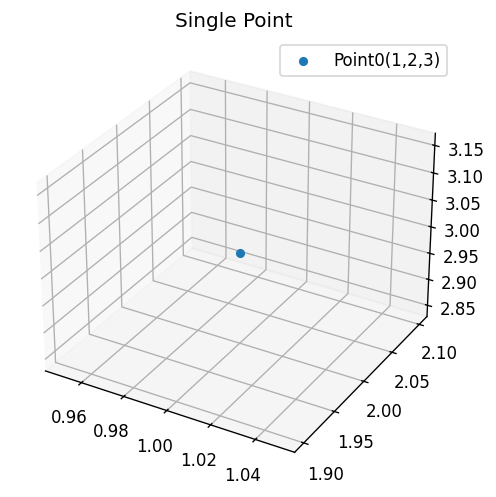 | 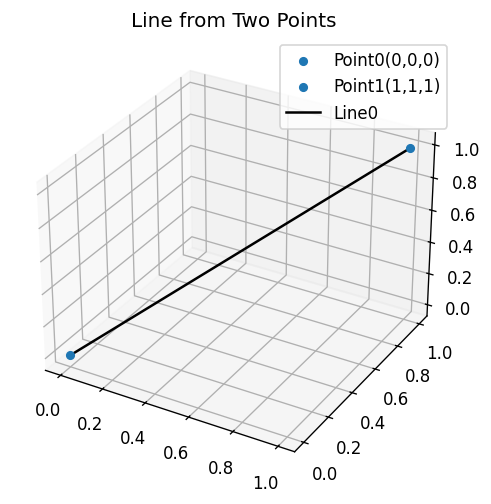 |
| A single `Point(1, 2, 3)`. | A `Line` joining two points. |
| 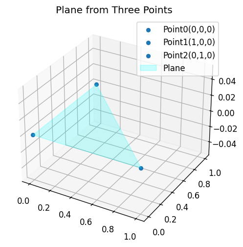 | 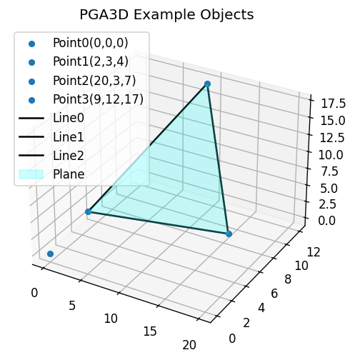 |
| A `Plane` built from three points. | Points, lines, and a plane drawn together. |
| 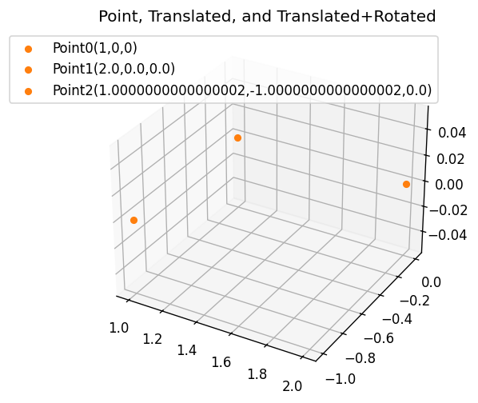 | 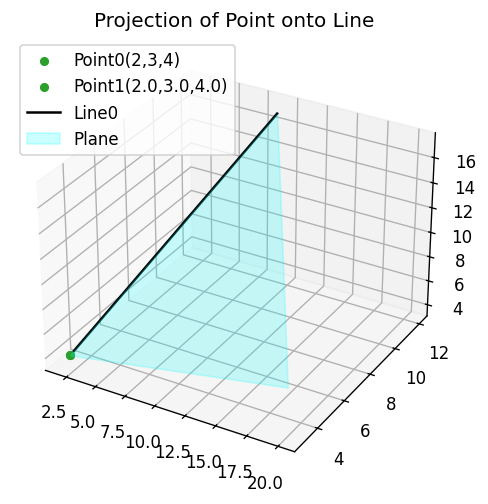 |
| A point, its translation, and a composed translation+rotation. | Projection of a point onto a line, with the supporting plane. |

### Regenerating the figures

```
python doc/generate_figures.py
```

### Status

Experimental and a work in progress.

---

## SimpleGA

`simplega` is a Python port of the Julia package
[`SimpleGA.jl`](https://github.com/ChrisDoran/SimpleGA.jl) by Chris
Doran. It provides compact, grade-split implementations of several
geometric algebras with a uniform API:

| Algebra | Module | Underlying representation |
| --- | --- | --- |
| `GA(2,0)` | [simplega/ga20.py](simplega/ga20.py) | complex numbers |
| `GA(3,0)` | [simplega/ga30.py](simplega/ga30.py) | quaternion-like `(w, x, y, z)` |
| `GA(3,1)` | [simplega/ga31.py](simplega/ga31.py) | 2×2 complex matrices |
| Quaternions | [simplega/quaternions.py](simplega/quaternions.py) | `(w, x, y, z)` |

Each algebra splits its multivectors into an **Even** part (grade 0 +
grade 2) and an **Odd** part (grade 1 + grade 3) so the geometric
product reduces to four small fixed-shape multiplications. The
top-level [simplega/__init__.py](simplega/__init__.py) module exposes
shared helpers: `project`, `bivector_exp`, `inject`, `dot`, `tr`,
`norm`, `adjoint`, `isapprox`.

### Citation / upstream

* Chris Doran, *SimpleGA.jl* — https://github.com/MonumoLtd/SimpleGA.jl
* Upstream documentation — https://monumoltd.github.io/SimpleGA.jl/dev/
* Doran & Lasenby, *Geometric Algebra for Physicists*, Cambridge
  University Press, 2003.

### Documentation

A Python-side documentation set adapted from the upstream Julia docs
lives under [doc/simplega/](doc/simplega):

* [Overview](doc/simplega/overview.md) — installation, first example,
  the Even / Odd trick.
* [API reference](doc/simplega/api.md) — bases, arithmetic, projection,
  exponentiation, helpers.
* [Algebras](doc/simplega/algebras.md) — per-algebra notes for
  `GA(2,0)`, `GA(3,0)`, `GA(3,1)`, and quaternions.

### Usage

Each algebra exposes the same `Even` / `Odd` pair plus a set of basis
elements. Multiplying an `Odd` by an `Odd` yields an `Even` (scalar +
bivector); multiplying an `Even` by an `Odd` yields an `Odd` again.
Rotations are written as the sandwich product `R v R†` where `R` is
the exponential of a bivector.

```python
import math
from simplega import ga30 as GA30
from simplega import project, bivector_exp, dot, norm

e1, e2, e3, I3 = GA30.e1, GA30.e2, GA30.e3, GA30.I3
Even = GA30.Even

# Build vectors (grade 1) and decompose the geometric product
v1 = 0.9 * e1 + 0.4 * e2
v2 = 0.4 * e1 + 0.8 * e3
g  = v1 * v2                              # Even = scalar + bivector

inner = project(g, 0)                     # <v1, v2>
outer = project(g, 2)                     # v1 ^ v2

# Build a rotor from a bivector and rotate a vector via sandwich product
B = Even(0.0, 0.0, 0.0, math.pi / 4)      # −(π/4)·e1e2  (90° around z)
R = bivector_exp(B)
v = 0.8 * e1 + 0.2 * e2 + 0.5 * e3
v_rot = R * v * R.adjoint                 # R v R†

print("|v|       =", norm(v))
print("|R v R†|  =", norm(v_rot))         # rotations preserve the norm
```

Quaternion-style rotations use the dedicated module:

```python
import math
from simplega.quaternions import Quaternion

# 90° rotation around z as a unit quaternion
q = Quaternion(math.cos(math.pi / 4), 0.0, 0.0, math.sin(math.pi / 4))
p = Quaternion(0.0, 1.0, 0.0, 0.0)        # pure-imaginary = vector (1, 0, 0)
p_rot = q * p * q.conj()                  # → (0, 1, 0)
```

### Examples — `GA(3,0)` elements and transformations

`GA(3,0)` is isomorphic to the quaternions: its **Even** subalgebra
(scalar + bivectors) reproduces the quaternion algebra, and the
sandwich product `R v R†` rotates a grade-1 vector `v` exactly like
quaternion rotation. The figures below are produced by
[doc/generate_simplega_figures.py](doc/generate_simplega_figures.py),
which uses the `GA30Visualizer` class and the
`plot_grade_decomposition` helper from
[simplega/ga30_visualization.py](simplega/ga30_visualization.py).

| | |
| --- | --- |
| 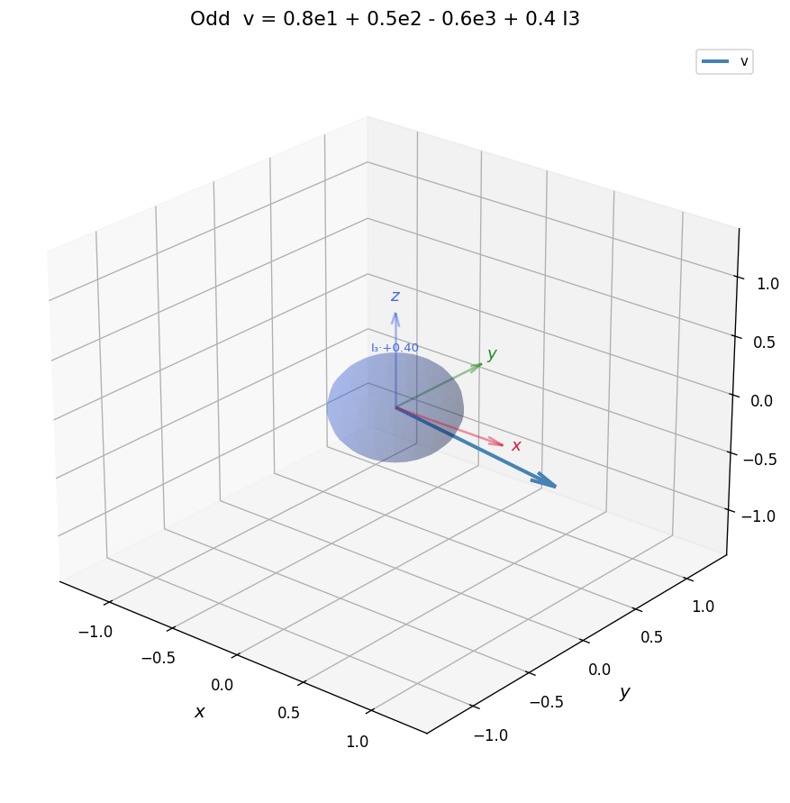 | 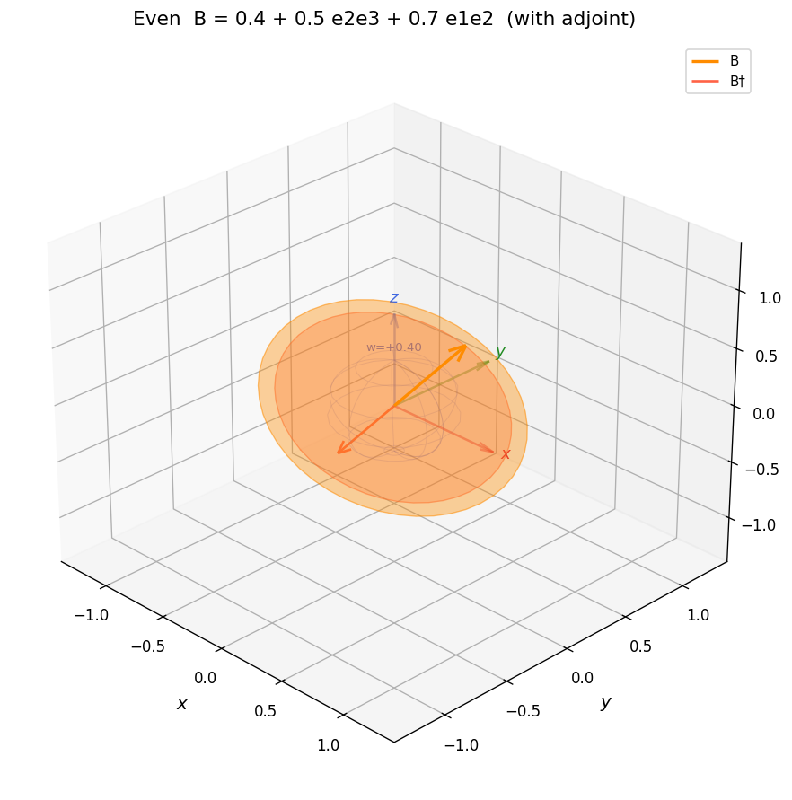 |
| **Odd** element `v = 0.8 e1 + 0.5 e2 − 0.6 e3 + 0.4 I3`: arrow = grade-1 vector, sphere = grade-3 trivector. | **Even** element `B = 0.4 + 0.5 e2e3 + 0.7 e1e2` with its adjoint `B†`: disk = grade-2 bivector, wireframe sphere = grade-0 scalar. |
| 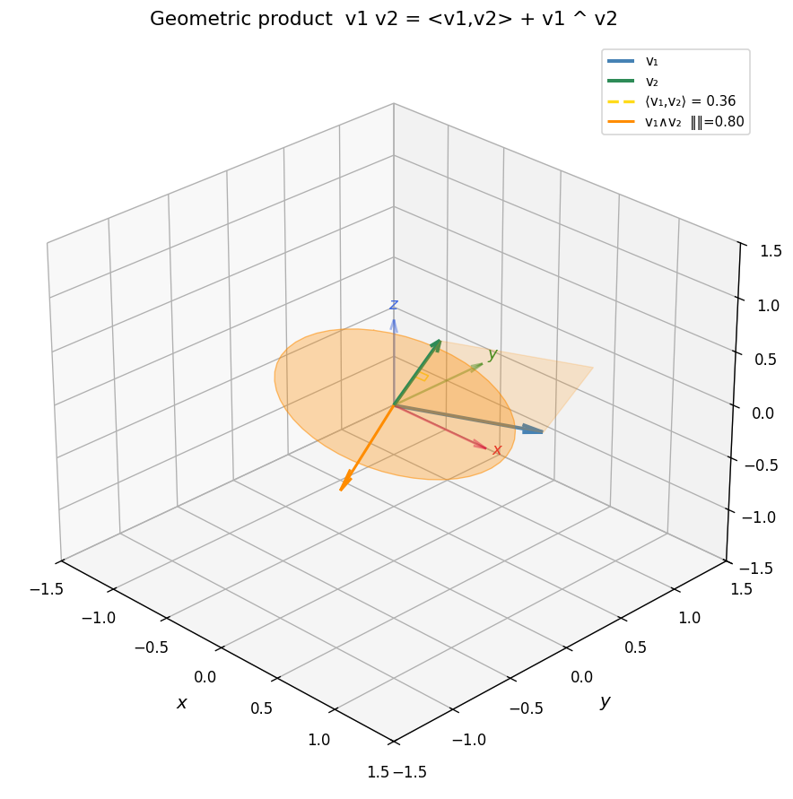 | 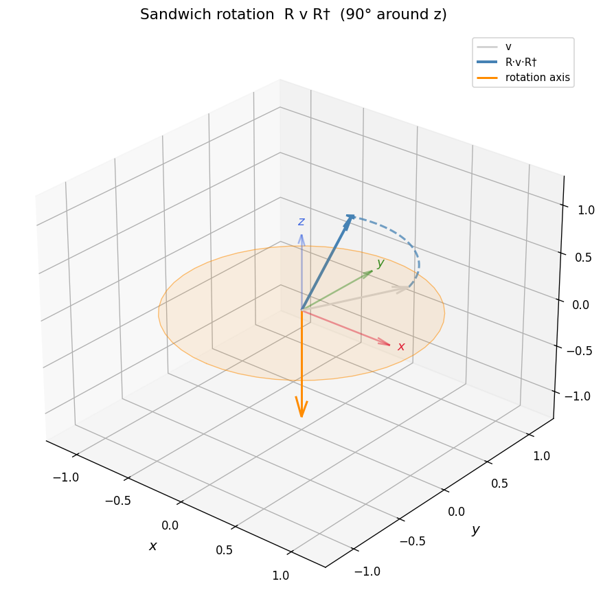 |
| Geometric product `v1 v2 = <v1, v2> + v1 ^ v2`: dashed line = inner product (scalar), disk + parallelogram = outer product (bivector). | Sandwich rotation `R v R†` with `R = exp(−(π/4) e1e2)` — a 90° rotation around `z` applied to a general vector. |
| 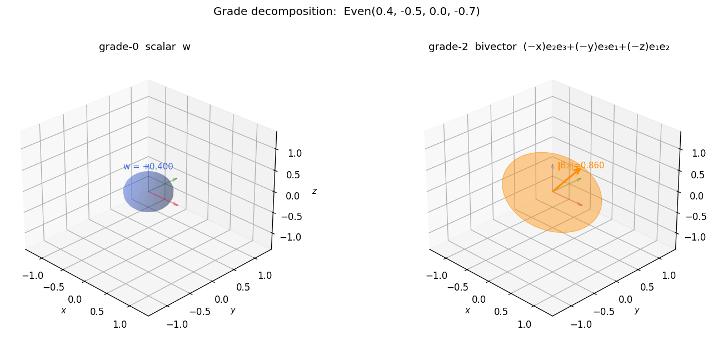 | 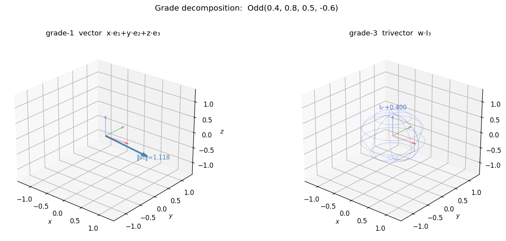 |
| Grade decomposition of an **Even** element into its grade-0 scalar and grade-2 bivector parts. | Grade decomposition of an **Odd** element into its grade-1 vector and grade-3 trivector parts. |

### Regenerating the figures

```
python doc/generate_simplega_figures.py
```

Standalone interactive demos for each algebra:

```
python simplega/ga30_visualization.py
python simplega/quaternion_visualization.py
python simplega/bivector_visualization.py
```
